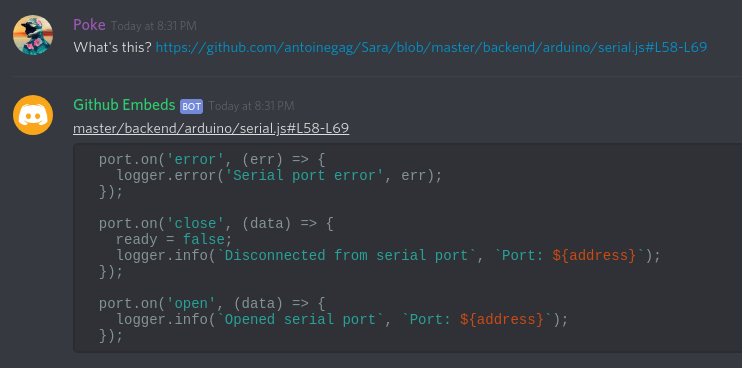

# github-embeds

Discord is a wonderful platform for gamers but it has evolved beyond that today, hosting a _ton_ of developer communities.

Most developers are familiar with Github, an online platform to host code and to work together. This bot pairs Github and Discord together to make sharing even easier.

When sending the link to a file on Github, the bot will fetch the content of said file for you and directly display it on Discord.

# Getting started

This will help you set up and run an instance of the bot

## Prerequisites

What you will need to get the bot running

- A Discord bot, follow the instructions here https://discordpy.readthedocs.io/en/latest/discord.html
- NPM, Yarn or any package manager
- NodeJS

## Download the source

Clone this repository or download the source on Github

## Install dependencies

Go into the directory where you downloaded the source code and run `npm install` or `yarn` into your terminal

## Add your bot token

To add your bot token, simply create a file named `.env` in the directory of the bot and add the line `DISCORD_SECRET=your_token` (replace by your bot token).

If you're on GNU/Linux `$ echo DISCORD_SECRET=your_token > .env`

## Run the bot

Run `yarn start` or `npm start` in your terminal to run the bot.

# Built with

- [NodeJs](https://github.com/nodejs/node)
- [Discord.js](https://github.com/discordjs/discord.js/)
- [node-fetch](https://github.com/bitinn/node-fetch)

# Authors

Antoine Gagnon

# License

This project is licensed under the MIT License - see the [LICENSE](LICENSE) file for details

_Entered in [Discord Community Hack Week](https://blog.discordapp.com/discord-community-hack-week-build-and-create-alongside-us-6b2a7b7bba33) under "Productivity"_
